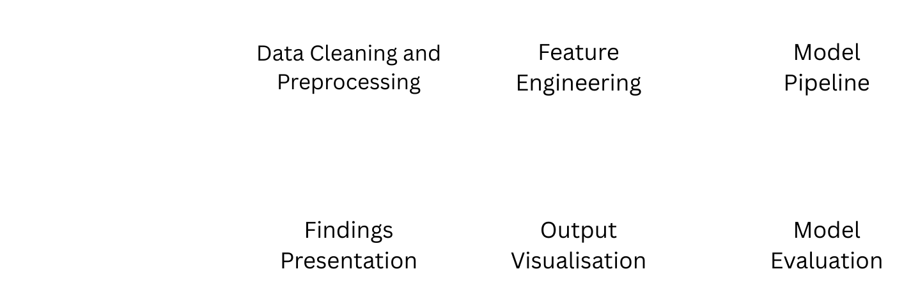

# Identifying Energy Poverty Hotspots in NSW

Which NSW suburbs hold back on electricity when the weather turns extreme? This flags a day as at-risk when the temperature falls in the top or bottom decile *and* the suburb's usage sits below its 25th percentile — households declining to heat or cool when they most need to — then aggregates the per-day probabilities into a suburb-level risk score.

## Approach

1. **Data engineering** — six years (2019–2024) of 15-minute zone-substation load data across NSW suburbs, Bureau of Meteorology station observations, and NSW locality shapefiles; per-suburb missing-data summary, targeted cleaning and imputation, then a merge of the climate and power series.
2. **Feature construction** — rolling heating and cooling degree days, extreme-temperature run lengths, and normalised usage deviations.
3. **Classification** — five classifiers on the binary at-risk label, each with its decision threshold chosen from the precision–recall curve rather than left at 0.5.
4. **Aggregation** — mean predicted probability per suburb becomes the risk score, mapped for geographic comparison, with feature importances read for interpretability.

## Results

| Model | Threshold | AUC | Accuracy | Precision | Recall | F1 |
|---|---|---|---|---|---|---|
| **LightGBM** | 0.5541 | 0.9969 | 0.9878 | 0.8559 | 0.8767 | **0.8662** |
| XGBoost | 0.4954 | 0.9968 | 0.9868 | 0.8323 | 0.8855 | 0.8581 |
| Random Forest | 0.3200 | 0.9896 | 0.9771 | 0.7076 | 0.8370 | 0.7669 |
| Decision Tree | 0.2631 | 0.9621 | 0.9329 | 0.3815 | 0.7841 | 0.5133 |
| Logistic Regression | 0.0868 | 0.8891 | 0.8746 | 0.2142 | 0.6674 | 0.3244 |

Five suburbs came out as at-risk. Lidcombe scored ~24% under both gradient-boosted models (24.2% LightGBM, 24.1% XGBoost) but only 16.4% under Random Forest — the three models agree on *which* suburbs, and disagree on *how much*, which is why the output is presented as a ranking for triage rather than a probability to act on directly. Hurstville North also flagged despite a higher socioeconomic ranking than its neighbours.

## Read the AUC carefully

0.997 is not as good as it looks. The at-risk label is defined from temperature and usage, and every feature is a transformation of temperature and usage — so the models are largely recovering a rule that was written down, not discovering energy poverty in the field. The number says the pipeline is internally consistent. It does not say the label is right.

The gap between the tree ensembles and logistic regression (F1 0.87 against 0.32) is the more meaningful comparison: the boundary is genuinely non-linear, and a linear model cannot express it at any threshold.

## Repo contents

| Path | Description |
|---|---|
| `notebooks/energy_poverty_analysis.ipynb` | Full pipeline: load → clean → merge → EDA → models → risk maps |
| `assets/suburb_hotspot_probabilities.csv` | Per-suburb risk output |
| `assets/extreme_day_risk_probabilities.csv` | Extreme-demand-day risk output |
| `docs/ENGG2112_Project_Report.pdf` | 15-page report |
| `docs/ENGG2112_Final_Presentation.pdf` | Slide deck |

**Data sources (not redistributed):** Ausgrid zone-substation load data, BOM weather observations, NSW locality boundaries (Spatial Services). See the report for details.

## Limitations

- No socioeconomic data. Income, income distribution and household-level data were never joined in, so a low-usage suburb on a hot day cannot be distinguished from an empty one or a well-insulated one.
- Zone substations aggregate many households. A suburb-level average hides the households actually at risk inside it.
- Weather comes from the nearest station, not the suburb.

## Context

Multi-disciplinary Engineering project (ENGG2112, University of Sydney, 2025 — course mark: 88 HD).

**Team:** Dawod Ghifari (first author — data pipeline, power/climate merging, modelling), Max Legzdin, Imran Fareez Azmy, Phoebe Lee.
